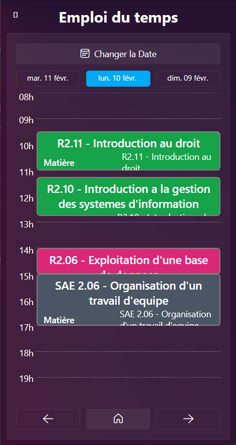
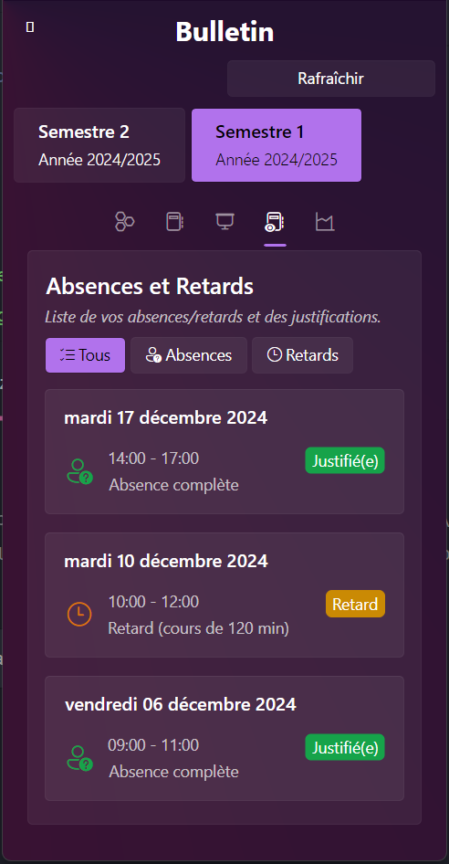
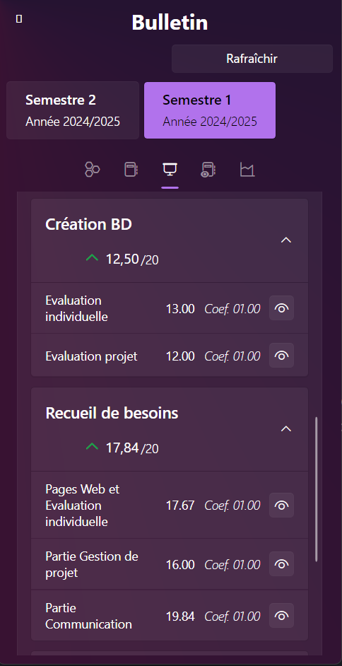
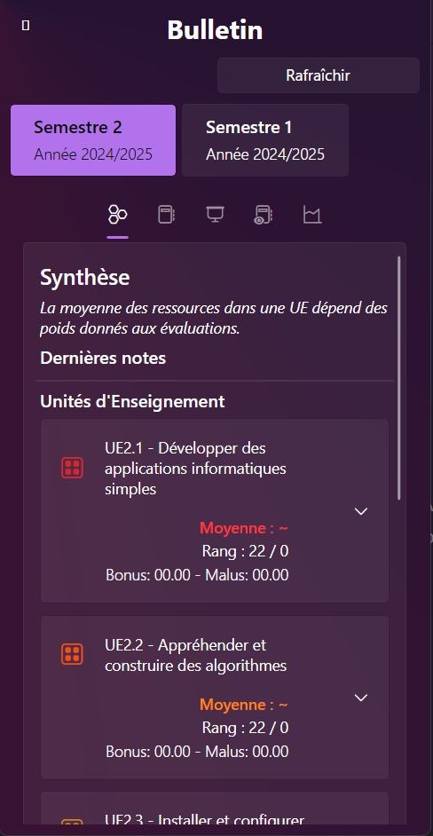
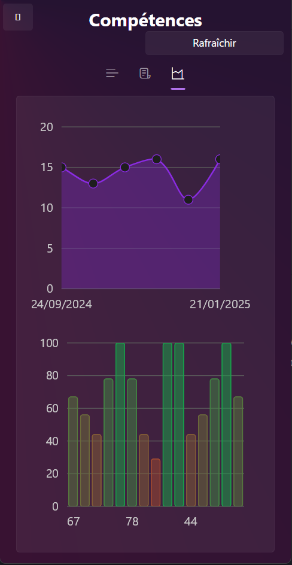
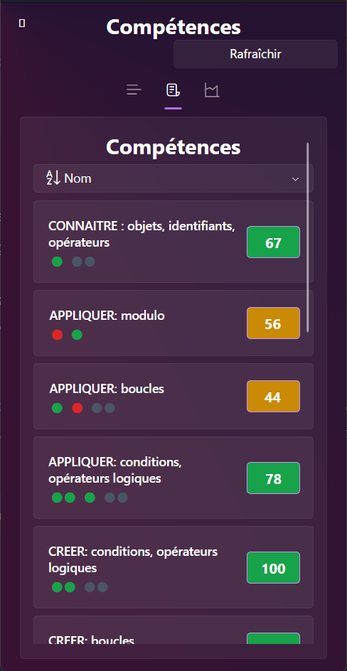

# Prolizy

Prolizy est une application mobile & de bureau moderne conçue pour simplifier l'accès aux outils numériques de l'IUT de Vélizy. Elle offre une interface unifiée et intuitive pour l'emploi du temps, les notes, et plus encore.


## 🌟 Fonctionnalités

### 📅 Emploi du temps
- Visualisation intuitive des cours (vue grille ou liste)
- Navigation facile entre les jours
- Informations détaillées sur chaque cours
- Overlay pour les absences et retards
- Widget Android pour voir le prochain cours




### 📊 Bulletin de notes
- Consultation des notes par semestre
- Statistiques détaillées par UE
- Graphiques de performance
- Vue d'ensemble des moyennes
- Historique des évaluations





### 🎯 SACoche (Compétences)
- Suivi des compétences acquises
- Visualisation des évaluations
- Graphiques de progression
- Vue détaillée des compétences




### 🏠 Page d'accueil personnalisable (bientôt)
- Cards configurables
- Vue rapide des informations importantes

## 🛠 Technologies utilisées

### Frontend
- [Avalonia UI](https://avaloniaui.net/) - Framework d'interface utilisateur cross-platform
- [FluentAvalonia](https://github.com/amwx/FluentAvalonia) - Style visuel moderne + Icônes
- [LiveCharts](https://github.com/beto-rodriguez/LiveCharts2) - Visualisations de données
- [CommunityToolkit.Mvvm](https://github.com/CommunityToolkit/dotnet) - Architecture MVVM

### Architecture & Design
- Architecture MVVM (Model-View-ViewModel)
- Design Pattern Observer pour la réactivité
- Injection de dépendances
- API REST pour la communication avec les services

### Sécurité
- Chiffrement des données sensibles
- Stockage sécurisé des identifiants
- Mode anonyme disponible

## 📱 Support Multi-plateformes

- ✅ Windows
- ✅ Android
- 🚧 Linux (en développement)
- 🚧 macOS (en développement)
- 🚫 iOS (non prévu)

## 🚀 Installation (Windows)

1. Téléchargez la dernière version depuis la page [Releases](https://github.com/ItsTheSky/Prolizy/releases)
2. Exécutez le fichier d'installation
3. Suivez l'assistant de configuration initial


## 💻 Développement

### Prérequis
- .NET 8.0 SDK
- IDE compatible (Visual Studio 2022, Rider, VS Code)

### Configuration
```bash
git clone https://github.com/yourusername/prolizy.git
cd Prolizy
dotnet restore
```

### Build

A faire dans le dossier `Prolizy.Viewer.Desktop` pour la version Windows!

```bash
dotnet build
```

## 🤝 Contribution

Les contributions sont les bienvenues ! Voici comment vous pouvez aider :

1. Fork le projet
2. Créez votre branche de fonctionnalité (`git checkout -b feature/AmazingFeature`)
3. Committez vos changements (`git commit -m 'Add some AmazingFeature'`)
4. Push vers la branche (`git push origin feature/AmazingFeature`)
5. Ouvrez une Pull Request

## 📝 License

Ce projet est sous licence MIT - voir le fichier [LICENSE.md](LICENSE.md) pour plus de détails.

## 👤 Auteur

**Nicolas RACOT** - 1ère année de BUT Informatique à l'IUT de Vélizy

- Discord: itsthesky
- GitHub: [@itsthesky](https://github.com/itsthesky)

## ⭐️ Support

Si vous trouvez Prolizy utile, pensez à mettre une étoile sur le projet !
